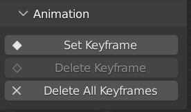

#####################################
Animation
#####################################

The add-on can set |keyframes| on the camera's location, rotation and focal length in order animate a transition from one set-up to another.

The controls are found in the *Animation* section of the panel.

.. |keyframes| raw:: html

   <a href="https://docs.blender.org/manual/en/latest/animation/keyframes/introduction.html" target="_blank">keyframes</a>

======================================================
Setting keyframes
======================================================

#. Drag up the *Timeline* view.

    .. image:: images/drag_timeline.gif

#. Select the active camera you wish to animate.

    .. image:: images/select_camera.jpg

#. Turn on the Perspective Plotter by clicking the *Plot Perspective* button.

    .. image:: images/anim_activate.gif

#. Move the position of the timeline to the frame you wish to set a keyframe, starting at zero.

    .. image:: images/anim_drag_slider.gif

#. Click the **Set Keyframe** button.  This will set keyframes for the camera's location, rotation and focal length at that point in time.

    .. image:: images/anim_set_keyframe.gif

#. Move the positon of the timeline and adjust the pespective axes to a different set up.  Click **Set Keyframe** again.

#. Repeat this process to set up the camera animation.

    .. image:: images/anim_complete.gif

======================================================
Deleting Keyframes
======================================================

You can delete the set of keyframes for a specific point in time with the **Delete Keyframe** button:

#. Position the timeline slider to the point where the you have keyframes set that you wish to delete.  
#. The **Delete Keyframe** button should become active.  
#. Press this button to delete the relevant camera keyframes at this point in time.

You can also delete all the keyframes by clicking **Delete All Keyframes**, which will delete all camera keyframes for the location, rotation and focal length.
