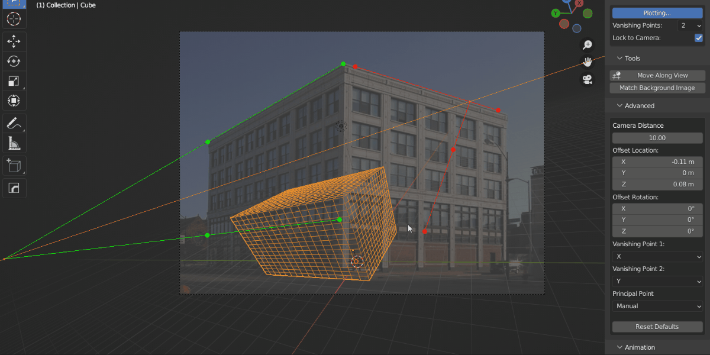

.. Perspective Plotter documentation master file, created by
   sphinx-quickstart on Tue Feb 22 11:16:33 2022.
   You can adapt this file completely to your liking, but it should at least
   contain the root `toctree` directive.

===============================================
Perspective Plotter
===============================================

---------------------------------
What is Perspective Plotter?
---------------------------------

Match a camera to an image with Perspective Plotter , an interactive |Blender| add-on for modelers, architects and artists.  This is useful for creating 3D models from 2D sketches, matching a 3D scene to a 2D photo, or animating a camera dynamically to match a video.

Defining perspective lines in the viewport sets a camera's focal length, location and position in real time.  The add-on will also work with more than one camera in a scene.

Additional :ref:`tools<Tools>` allow you to match a camera's background image proportions, quickly move vertices or objects along the view line, and automatically flatten the horizon.

The add-on is inspired by the freely available |fSpy| application, with the added benefit of being directly inside Bender.

.. |Perspective Plotter| raw:: html

   <a href="https://blendermarket.com/products/perspective-plotter" target="_blank">Perspective Plotter</a>

.. |fSpy| raw:: html

   <a href="https://fspy.io/" target="_blank">fSpy</a>

.. |Blender| raw:: html

   <a href="https://www.blender.org/" target="_blank">Blender</a>

---------------------------------
Features
---------------------------------

* Dynamically match the camera in real time using perspective guides.
* Choose from 1, 2 or 3 point perspective modes.
* Determine scale of the scene using a measuring guide.
* Animate the camera using keyframe buttons.
* Match background image proportions.
* Flatten horizon line automatically.
* Customize colors and opacity of guide lines.
* Freeze guides in place to prevent accidental changed.
* Use the bundled :ref:`Move Along View` tool to help model 3D meshes from 2D sketches.
* Change axes of vanishing points.
* Change camera midpoints and camera target location.

.. toctree::
   :maxdepth: 2
   :caption: Contents:

   installation
   quick_start
   settings
   tools
   animation
   preferences
   troubleshooting
   contact
   

