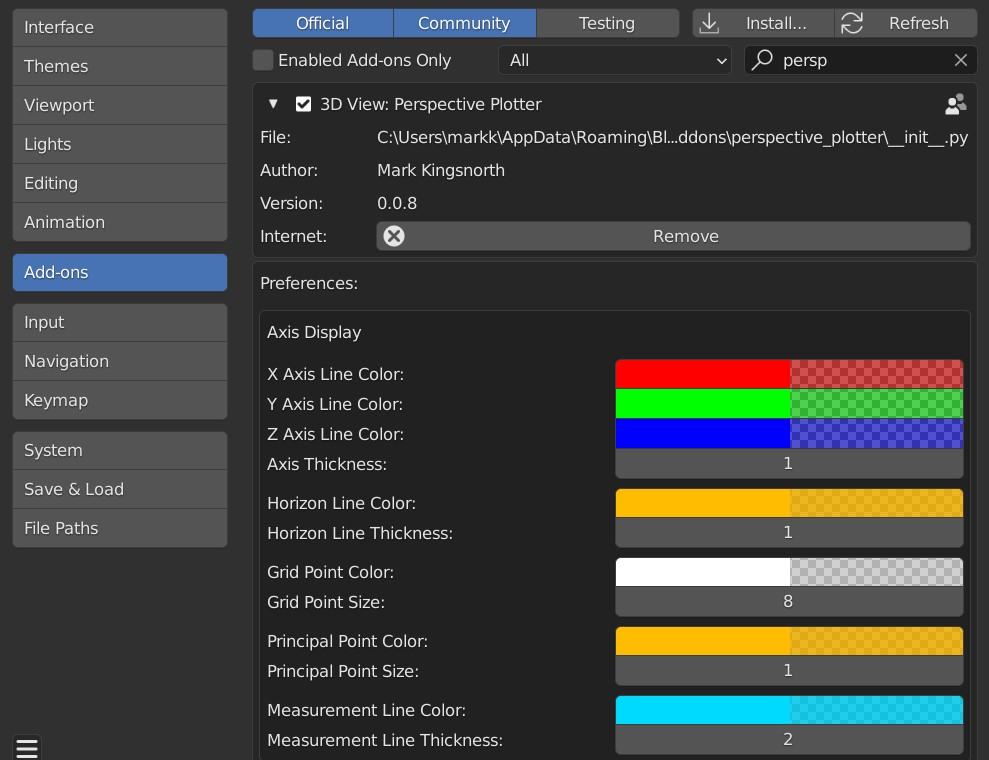

#############
Installation
#############

---------------------------------
Blender 4.2 and Above
---------------------------------

.. image:: images/installation.gif
   :alt: Installation

Drag and drop the installation zip file into Blender to install the add-on.  

If you have any issues do not hesitate to get in touch via `info@configurate.net <mailto:info@configurate.net>`_.

---------------------------------
Previous Blender Versions
---------------------------------

|Video Link|

.. |Video Link| raw:: html

   <a href="https://youtu.be/MNyxm5eU8Sg?t=41" target="_blank">Video Link</a>

#. Go to *Edit* -> *Preferences*.
#. Select the *Add-ons* tab on the left if it is not already.
#. Select the *Install...* button along the top.
#. This will open a file dialog. Navigate to where you have downloaded the **perspective_plotter.zip** file.  This file should not be unzipped.
#. Then, click the *Install add-on from file* button.
#. Search for the add-on by typing *Perspective Plotter* in the search box if it does not already appear.
#. Make sure the checkbox next to the Add-on (*3D View: Perspective Plotter*) is ticked:

If you have any issues do not hesitate to get in touch via `info@configurate.net <mailto:info@configurate.net>`_.