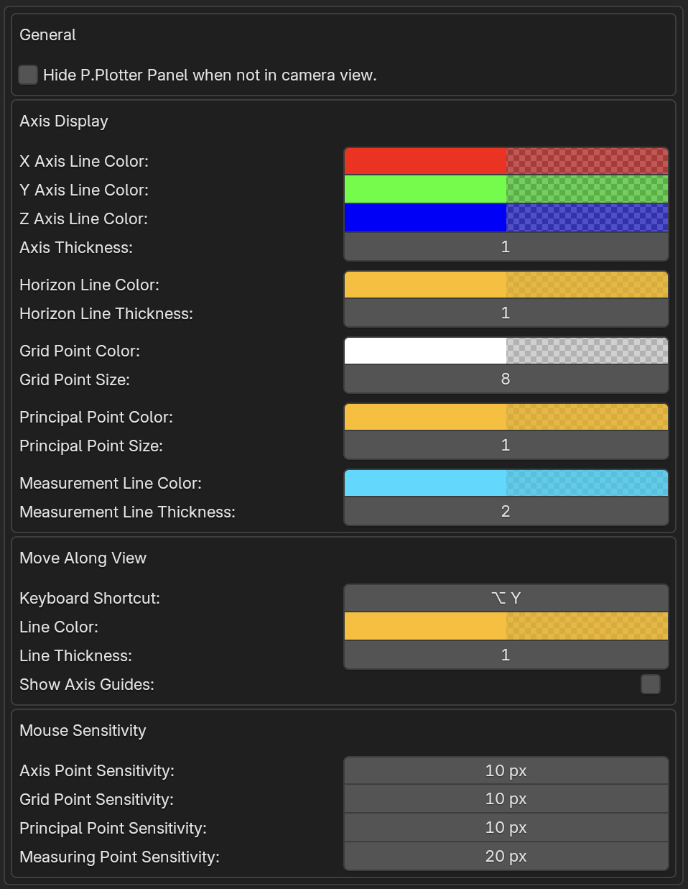

#####################################
Preferences
#####################################

You can adjust color, line thickness, and other aspects of the add-on by going to *Edit -> Preferences -> Add-ons* and expanding the *Perspective Plotter* entry.

======================================================
Axis Display Preferences
======================================================

X/Y/Z color
-------------------

This will change the colors and transparency of the different perspective axes.

Axis thickness
-------------------

Change the thickness of the Axis lines and control points.

Horizon Line color
---------------------

Change the color and transparency of the horizon line.

Horizon Line thickness
---------------------------

Change the thickness of the horizon line.

======================================================
Move Along View Preferences
======================================================

This configures the :ref:`Move Along View` tool.

Keyboard Shortcut
----------------------

You can change the keyboard shortcut for this tool by clicking on the parameter and pressing a new key combination.

Line color
--------------------

Change the color of the lines projected by the tool.

Line thickness
--------------------

Change the thickness of the lines projected by the tool.

Show Axis Lines
-----------------------

You can display X/Y/Z axis lines when moving a vertex or object if it aids placement.