#####################################
Settings
#####################################

======================================================
Vanishing Points
======================================================

There are different modes that allow you to set up your scene according to one, two and three |perspective types|.  Each mode is slightly different to configure when estimating the camera view for the 3D scene:

.. |perspective types| raw:: html

   <a href="https://tips.clip-studio.com/en-us/articles/807", target="_blank">perspective types</a>

One-Point Mode
------------------------------------------

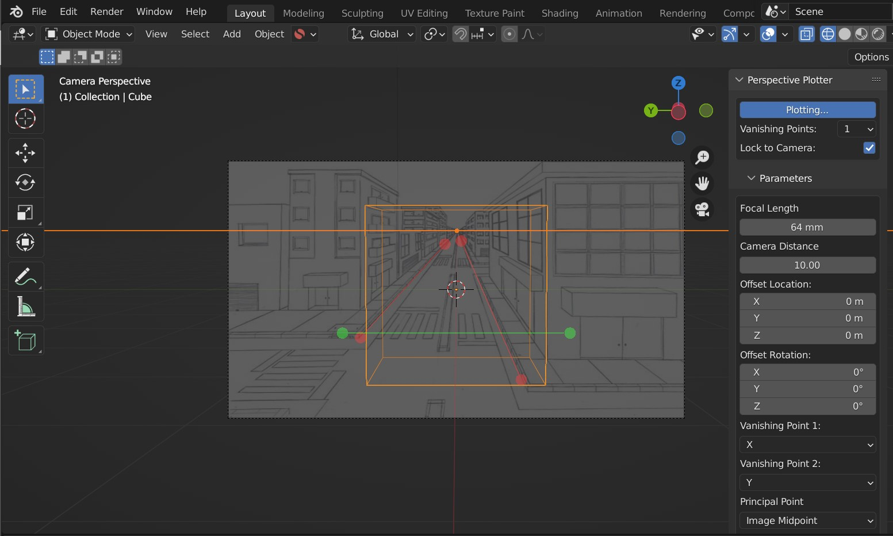

Here you define a single vanishing point using two control axes, and a horizon line direction controlled by one.  The vanishing point will always converge at the horizon line.   

Because the camera needs extra depth information in this mode, an editable :ref:`Focal Length` parameter is provided in the parameters setting to calculate the viewing angle.

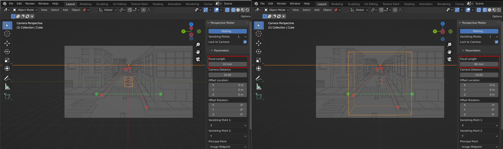

    Focal Length control in one-point perspective: 10mm (left) and 80mm (right)

Two-Point Mode
------------------------------------------

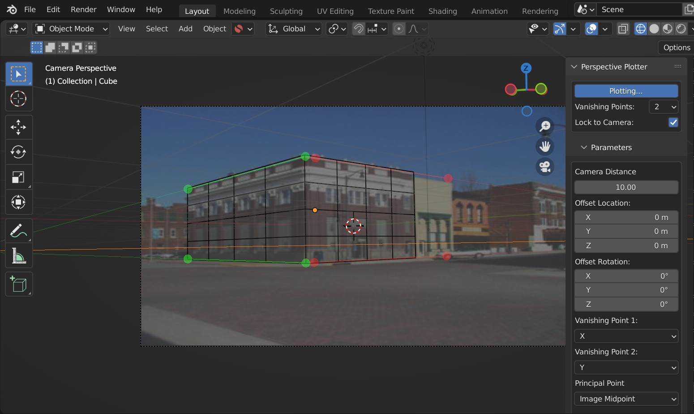

This is the default mode, allowing you to define two vanishing points.  These vanishing points are controlled through a pair of control axes per vanishing point.  

As it is close to what the human eye usually sees, it is the most used perspective with sketches and illustrations (see |perspective types|).

The third vanishing point is estimated based on the other two vanishing points and the :ref:`Principal Point`.

Three-Point Mode
------------------------------------------

.. image:: images/three-point-perspective.jpg
    :alt: Perspective Plotter Controls

Here you have three pairs of control axes to define the vanishing points.  This is for when you have enough information from references to define the third vanishing point accurately.

Three-point perspective is used for drawing compositions that are looking up at a large object or looking down from a high place (see |perspective types|).

======================================================
Lock to Camera
======================================================

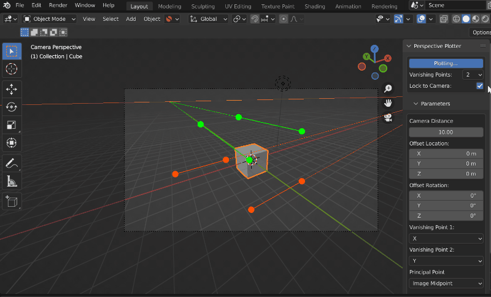

If you want to set up the perspective axis lines without altering the camera in realtime, disabling this option will stop the perpective plotter from calculating.  Turning the option on again will snap the camera to the vanishing points.

======================================================
Parameters
======================================================

Focal Length
------------------------------------------

.. note::
    Editable in one-point perspective mode only.

Focal Length value which is pre-calculated in 2 and 3 point perspective modes.  In one-point perspective mode, this will provide further depth information to the camera.

Reference Distance
------------------------------------------

|ref_dist_video|

.. |ref_dist_video| raw:: html

    <iframe width="560" height="315" src="https://www.youtube.com/embed/INqeNav7Cg4" title="YouTube video player" frameborder="0" allow="accelerometer; autoplay; clipboard-write; encrypted-media; gyroscope; picture-in-picture" allowfullscreen></iframe>

There are parameters that will help you set the camera’s distance from the :ref:`target location`, something that cannot be determined from vanishing points alone.

Default: Camera Distance
^^^^^^^^^^^^^^^^^^^^^^^^^^^^^^^^^^^^^^^^^^

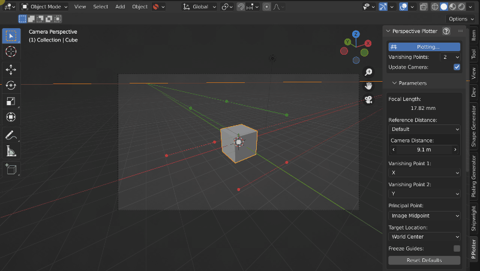

By default, the camera is moved away from the :ref:`target location` by a set distance which is controlled by the **Camera Distance** parameter.

Along X/Y/Z Axis
^^^^^^^^^^^^^^^^^^^^^^^^^^^^^^^^^^^^^^^^^^

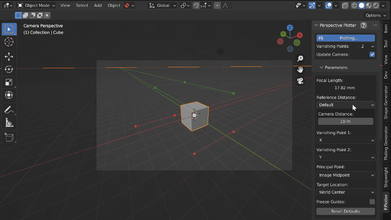

You can alternatively set the camera distance by measuring a line from the :ref:`target location` to a vanishing point.  This is useful when you know the length of something in the reference image.

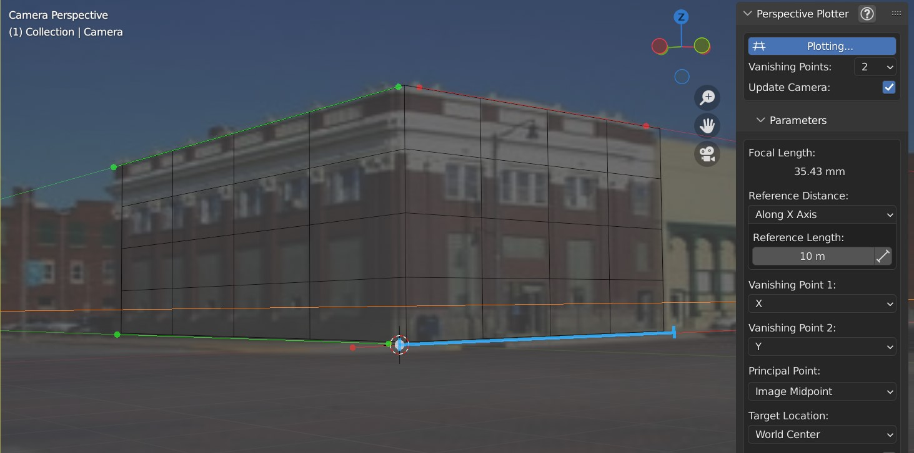

To set the camera distance this way, change the “Default” setting under “Reference Distance” to “Along X, Y or Z Axis”.  

You’ll see a shortened blue line appear along the camera’s scene origin to the vanishing point of the specified vanishing point axis. You can adjust this line by dragging on either end or by altering the relative points in the panel by clicking the small measuring symbol next to “Reference Length”.

Grid Point
------------------------------------------

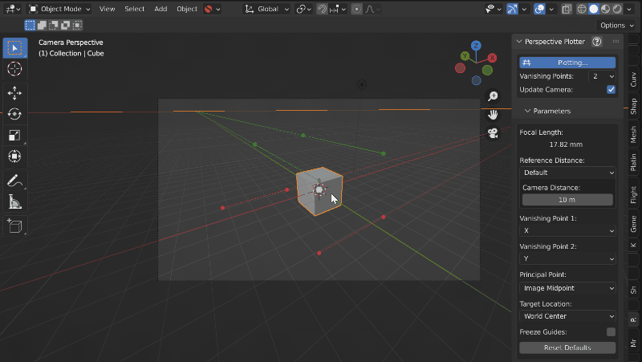

In every mode, you’ll notice a white dot in the center of the view.  This is the position of the :ref:`target location`.  You can left click and drag this point to change the position of the grid’s center from the view.

Vanishing Point 1
------------------------------------------

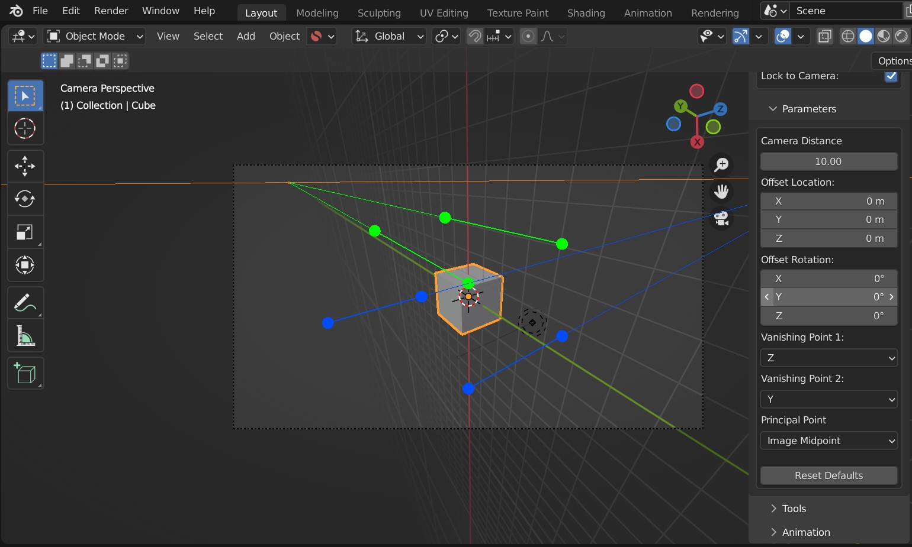

    Vanishing Point 1 set to the Z direction.

This changes the axis for the first vanishing point (Default: X).  The third vanishing point axis is calculated based on the first two vanishing points.

Vanishing Point 2
------------------------------------------

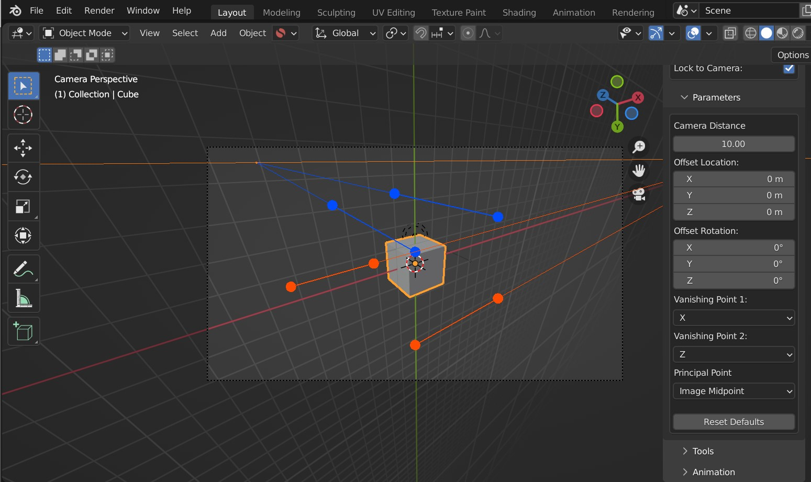

    Vanishing Point 2 set to the Z direction.

This changes the axis for the second vanishing point (Default: Y).  The third vanishing point axis is calculated based on the first two vanishing points.

Principal Point
------------------------------------------

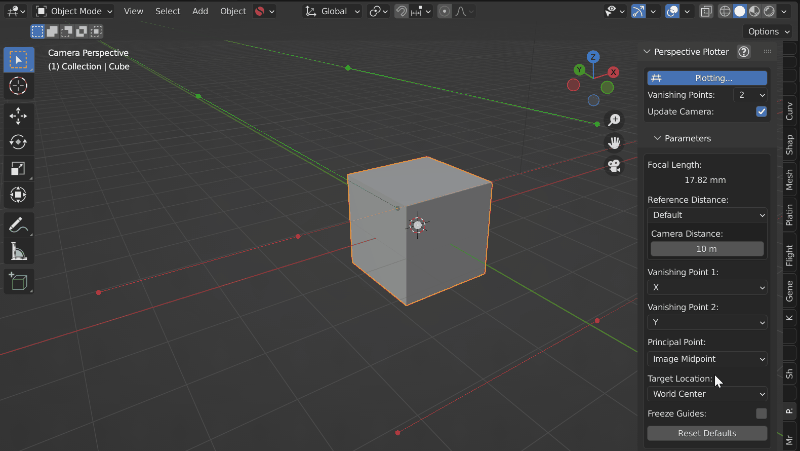

The principal point describes where the middle ray of the scene would hit the camera lens.  For one and two point perspective modes, this is assumed to also be the middle of the view by default.  

Switching this setting from *Image Midpoint* to *Manual* will allow you to change where the Principal Point is by clicking and dragging the point in the viewport.  

In three point perspective mode, this Principal Point is automatically calculated from all three vanishing points. 

Best described in the documentation for |fSpy|:

    *Imagine a ray going straight through the middle of a camera’s lens. The point where this ray hits the sensor (or film) is the principal point. This point usually coincides with the midpoint of the image. In some cases, for example if an image has been asymmetrically cropped, the principal point might be somewhere else. If the position is known, select manual from the principal point menu and drag the...control point to the position of the principal point.*

.. |fSpy| raw:: html

   <a href="https://fspy.io/">fSpy</a>

Target Location
------------------------------------------

This is the position that the camera looks at, which is by default the center of the 3D world.

You can change the target location in the side panel by selecting the “Manual” from the :ref:`Target Location` drop-down.  You will then see the location and rotation parameters to change the  target location. 

Location
^^^^^^^^^^^^^^^^^^^^^^^^^^^^^^^^^^^^^^^^^^

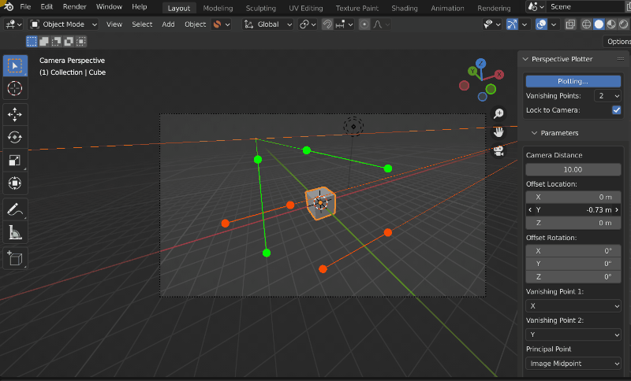

This offsets the camera's location from the middle of the scene.

Rotation
^^^^^^^^^^^^^^^^^^^^^^^^^^^^^^^^^^^^^^^^^^

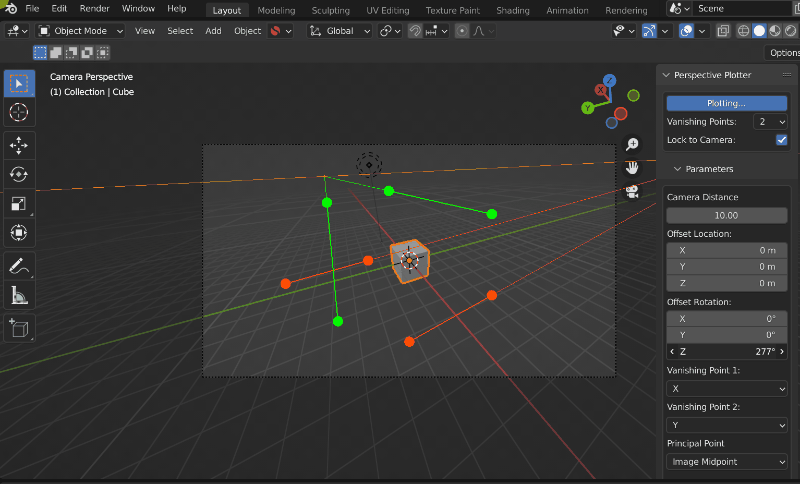

This can be used to alter the camera's rotation, relative to the center.

Set to 3D Cursor
^^^^^^^^^^^^^^^^^^^^^^^^^^^^^^^^^^^^^^^^^^

Sets the location and rotation of the Target to the 3D cursor.

Freeze Guides
------------------------------------------

This will freeze all viewport guide control points in place to allow you to interact with the scene without accidentally moving them.

Reset Defaults
------------------------------------------

This button will reset all settings to their default configuration.