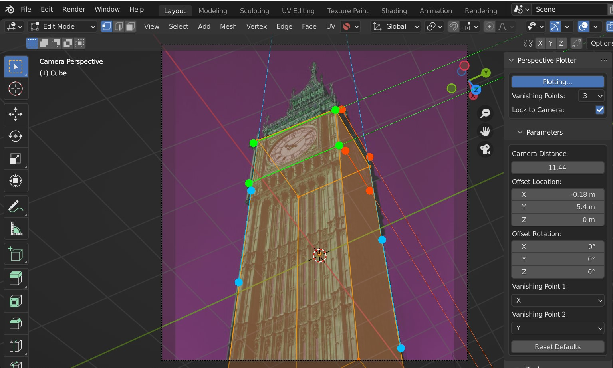

#####################################
Settings
#####################################

======================================================
Vanishing Points
======================================================

There are different modes that allow you to set up your scene according to one, two and three |perspective types|.  Each mode is slightly different to configure when estimating the camera view for the 3D scene:

.. |perspective types| raw:: html

   <a href="https://tips.clip-studio.com/en-us/articles/807", target="_blank">perspective types</a>

One-Point Mode
------------------------------------------

Here you define a single vanishing point using two control axes, and a horizon line direction controlled by one.  The vanishing point will always converge at the horizon line.   

Because the camera needs extra depth information in this mode, a :ref:`Focal Length` parameter is provided in the parameters setting to calculate the viewing angle.

    Focal Length control in one-point perspective: 10mm (left) and 80mm (right)

Two-Point Mode
------------------------------------------

This is the default mode, allowing you to define two vanishing points.  These vanishing points are controlled through a pair of control axes per vanishing point.  

As it is close to what the human eye usually sees, it is the most used perspective with sketches and illustrations (see |perspective types|).

The third vanishing point is estimated based on the other two vanishing points and the :ref:`Principal Point`.

Three-Point Mode
------------------------------------------

Here you have three pairs of control axes to define the vanishing points.  This is for when you have enough information from references to define the third vanishing point accurately.

Three-point perspective is used for drawing compositions that are looking up at a large object or looking down from a high place (see |perspective types|).

======================================================
Lock to Camera
======================================================

If you want to set up the perspective axis lines without altering the camera in realtime, disabling this option will stop the perpective plotter from calculating.  Turning the option on again will snap the camera to the vanishing points.

======================================================
Parameters
======================================================

Focal Length
------------------------------------------

.. note::
    One-point perspective mode only.

This will provide further depth information to the camera when operating in one-point perspective mode.

Camera Distance
------------------------------------------

The camera is moved away from the center of the scene by a set distance which is controlled here.

Offset Location
------------------------------------------

This offsets the camera's location from the middle of the scene.

Offset Rotation
------------------------------------------

.. image:: images/offset_rotation.gif
    :alt: Offset Rotation

This can be used to alter the camera's rotation, relative to the center.

Vanishing Point 1
------------------------------------------

    Vanishing Point 1 set to the Z direction.

This changes the axis for the first vanishing point (Default: X).  The third vanishing point axis is calculated based on the first two vanishing points.

Vanishing Point 2
------------------------------------------

.. figure:: images/vp_2_z.jpg
    :alt: VP one point set to Z

    Vanishing Point 2 set to the Z direction.

This changes the axis for the second vanishing point (Default: Y).  The third vanishing point axis is calculated based on the first two vanishing points.

Principal Point
------------------------------------------

The principal point describes where the middle ray of the scene would hit the camera lens.  For one and two point perspective modes, this is assumed to also be the middle of the view by default.  

Switching this setting from *Image Midpoint* to *Manual* will allow you to change where the Principal Point is by clicking and dragging the point in the viewport.  

In three point perspective mode, this Principal Point is automatically calculated from all three vanishing points. 

Best described in the documentation for |fSpy|:

    *Imagine a ray going straight through the middle of a camera’s lens. The point where this ray hits the sensor (or film) is the principal point. This point usually coincides with the midpoint of the image. In some cases, for example if an image has been asymmetrically cropped, the principal point might be somewhere else. If the position is known, select manual from the principal point menu and drag the...control point to the position of the principal point.*

.. |fSpy| raw:: html

   <a href="https://fspy.io/">fSpy</a>

Reset Defaults
------------------------------------------

This button will reset all settings to their default configuration.