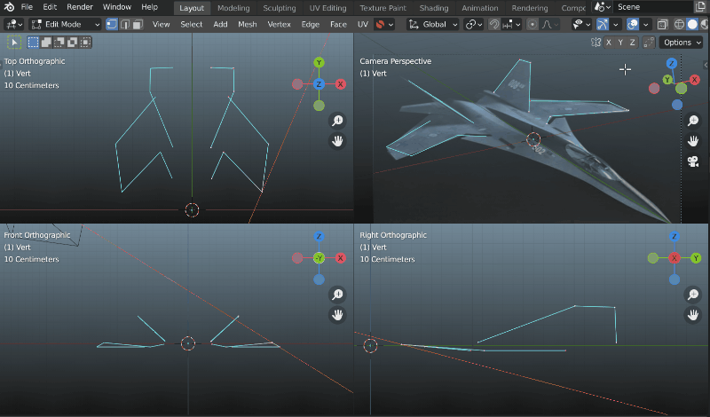

#####################################
Tools
#####################################

This section overviews some additional tools that are also part of the add-on.

======================================================
Move Along View
======================================================

**Keyboard Shortcut**: :kbd:`Ctrl-Y`

    Moving a vertex along a view line to place it in the correct position in 3D space.  Note Blender's |quad view| is used here with the *Maya* theme.  A *Mirror* modifier is used to reflect the mesh, so that the mirrored vertex is placed in the correct position.

*Move Along View* allows you to move vertices and objects along a viewport's line of sight.  This is useful when creating a 3D model or placing objects using a 2D sketch or photo as a reference.  To use:

#. Select the vertex or object that you wish to move along the viewport's line of sight.
#. With the mouse hovering in the view you wish to move along, press :kbd:`Ctrl-Y` (default) or press the *Move Along View* button in *Perspective Plotter*'s side panel.
#. Moving the mouse will change the position of the vertex or object along the view.  Guide lines are displayed in other top/down or left/right viewports to show where the view line is.

You can change the viewport shortcut under the add-on's :ref:`Preferences` section.

.. note::
    There is an |alternate method| in Blender for doing this, and this tool is provided for convenience so that you do not need to switch modes whilst modelling. 

.. warning::
    *Curve* control points are not currently supported.

.. |Quad View| raw:: html

   <a href="https://docs.blender.org/manual/en/latest/editors/3dview/navigate/views.html">Quad View</a>

.. |alternate Method| raw:: html

   <a href="https://blender.stackexchange.com/questions/182242/moving-vertices-along-view-axis-between-camera-and-vertex-position">alternate method</a>

====================================================================
Match Background
====================================================================

    .. image:: images/match_bg.gif
        :alt: Match BG Image

.. warning::
    This changes the output dimensions for an output image or animation.

The Add-On comes with a button that allows you to quickly set the viewport output's dimensions to the camera's background image or video.

    .. image:: images/match_bg_btn.jpg
        :alt: Open BG Image

You will need to set a background image or video before pressing the button:

#. To set a background image or video, in the Outliner panel click on the camera object to select it.

    .. image:: images/set_bg_select_cam.jpg
        :alt: Set BG

#. In the Properties panel click on the camera properties tab.

    .. image:: images/camera_props.jpg
        :alt: Camera Properties

#. Select the checkbox for *Background Images*, then click on the *Add Image* button.

    .. image:: images/cam_props_add_bg.jpg
        :alt: Camera Properties

#. Select *Image* or *Movie clip*, and click on the *Open* button.

    .. image:: images/bg_image_open.jpg
        :alt: Open BG Image

#. Locate and select your background image or video and click on the *Open Image* button.

    .. image:: images/open_image.jpg
        :alt: Open BG Image

#. Now, in the *Perspective Plotter* panel click the "Match Background" button under the *Tools* tab:

    .. image:: images/match_bg_btn.jpg
        :alt: Open BG Image