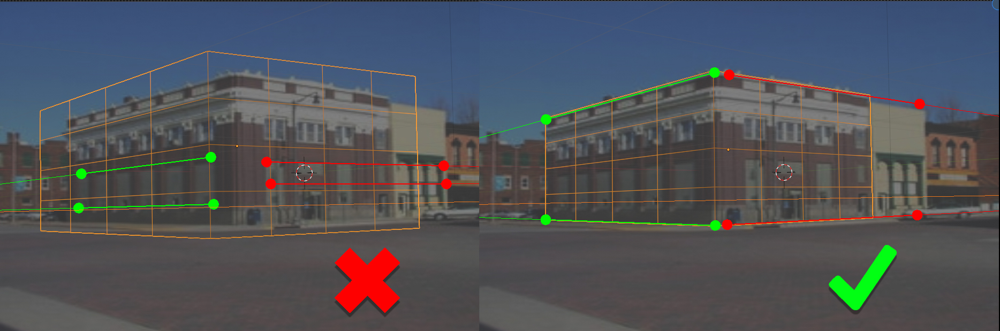
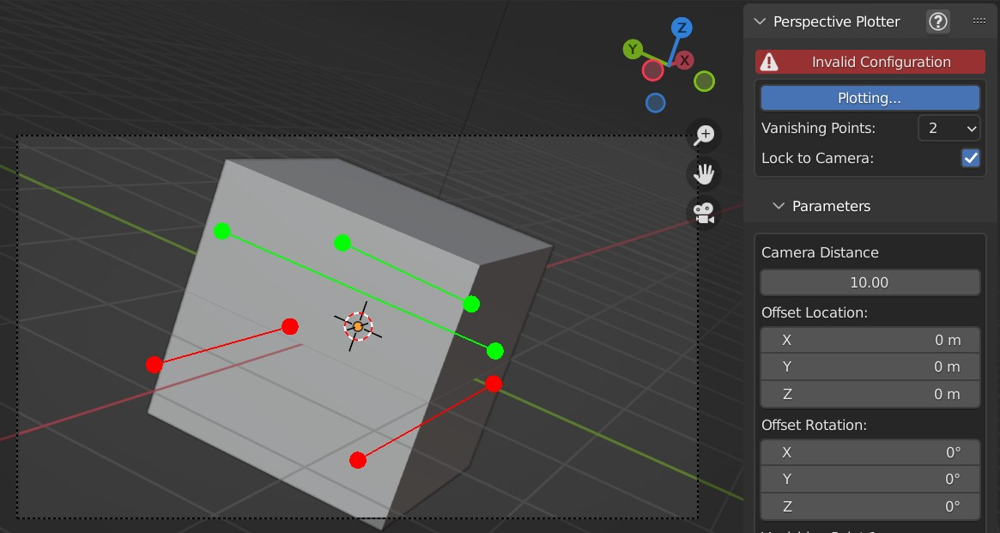
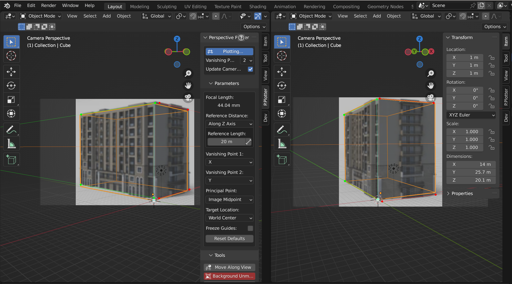
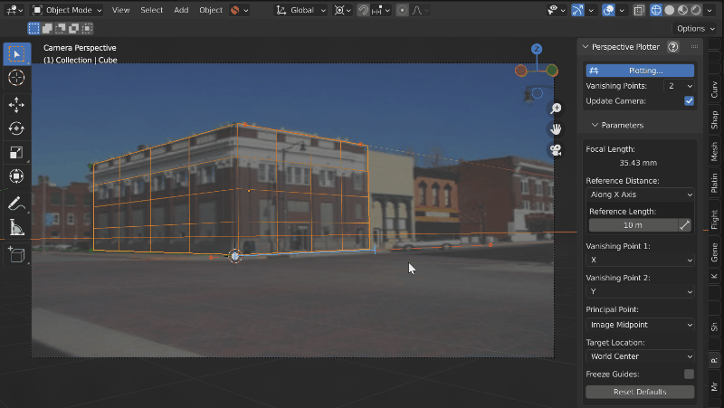
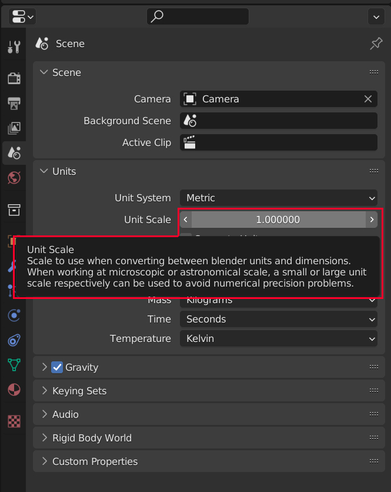

#####################################
Tips and Troubleshooting
#####################################

.. note::
    If you're having any trouble and it is not answered here, don't hesitate to :ref:`contact us<Contact>`.

======================================================
I cannot see the P.Plotter Panel after installation
======================================================

The Panel will only appear if you are |viewing though the Active Camera|.

.. |viewing though the Active Camera| raw:: html

   <a href="https://docs.blender.org/manual/en/2.79/editors/3dview/navigate/camera_view.html" target="_blank">viewing though the Active Camera</a>

============================================================================================================
I cannot see any of the control lines when I click "Plot Perspective"
============================================================================================================

Try updating your Graphics Cards drivers and if the problem does not go away :ref:`contact us<Contact>`.

========================================================
Setting up perspective lines
========================================================

    On the left, the perspective lines are too close together to provide enough information to the add-on for a good camera match.  On the right, the perspective lines are further apart and provide the best information when estimating camera orientation.

When setting up perspective lines try and choose lines in an image that are far apart.  This will give the add-on the best information to estimate camera position.  Lines that are close together can be too parallel and perspective errors can be introduced.

======================================================
Invalid Configuration
======================================================

The add-on uses geometry calculations described |here| to estimate camera rotation, angle and focal length.  

This calculation cannot be done in certain scenarios. For instance, if the vanishing points are too parallel or fall outside the :ref:`Principal Point` of the camera lens.  

If this is the case, the add-on temporarily marks the configuration as invalid and stops moving the camera.  

To rectify this, keep adjusting the perspective axes until a valid configuration occurs.

.. |here| raw:: html

   <a href="https://www.coursera.org/lecture/robotics-perception/how-to-compute-intrinsics-from-vanishing-points-jnaLs" target="_blank">here</a>

======================================================
Using a reference distance to increase accuracy
======================================================

|ref_dist_video|

.. |ref_dist_video| raw:: html

    <iframe width="560" height="315" src="https://www.youtube.com/embed/INqeNav7Cg4" title="YouTube video player" frameborder="0" allow="accelerometer; autoplay; clipboard-write; encrypted-media; gyroscope; picture-in-picture" allowfullscreen></iframe>

=====================================================
How do I set up multiple views on the same object?
=====================================================

Here we will use the white :ref:`Target Location` dot and the :ref:`Reference Distance` feature to set up a common reference point when using multiple views on the same object.

.. note::
    Multiple reference images may have minor lens distortions that can cause inaccuracies when trying to match reference points.

#. In the top right of a viewport, click and drag to create new 3D views:

    .. image:: images/drag_multiple_views.gif
        :alt: Drag Multiple Views

#. Add a new camera by pressing *shift-A* in the viewport and selecting *Camera* from the *Add* menu that appears. A new camera will be added to the origin point of the scene.

#. By default, the active camera will always be the the one you can see through a viewport.  For the new view, override this by pressing the *N* key whilst the mouse is in that viewport to see the side view properties tabs.  Under the view tab, tick the *Local Camera* checkbox and select the new Camera in the dropdown box next to it:

    .. image:: images/mv_add_image.png
        :alt: Add images

#. Load images for each of the cameras by selecting each camera, going to the Camera's *Object Data Properties* tab, and adding an image:

    .. image:: images/mv_add_bg_image.png
        :alt: Add BG images

    Also, for each image, set the *Frame Method* to *Fit*.  This will keep image in proportion for all cameras, seen at the bottom here:

    .. image:: images/mv_fit_image.png
        :alt: Fit BG images

#. In each viewport, use the *View -> Viewpoint -> Camera* menu option to view from each respective camera (or press *0* on the keyboard numpad).  Then, press the *N* key in each viewport to see the side properties tabs if they are not there already.  Select the *P.Plotter* panels.  Each panel will control the camera associated with each view.  It is best to leave the red 'Background Unmatched' button alone on the Perspective Plotter panel for multiple images, as Blender tries to match the image resolution for all cameras to one image.

#. Click 'Plot Perspective' on each panel.  Each view will snap to the default position, but the controls are separate.  Here I have some simple example images of the same building:

    .. image:: images/mv_pp_mviews.png
        :alt: Fit BG images 1

#. Firstly, in each view drag the white dot, which by default represents the middle of the scene *(0,0,0)*, to a common point on each image.  In this example, I am using the bottom corner of the building:

    .. image:: images/mv_drag_white_dot.png
        :alt: Drag white dot.

#. Switch to wireframe mode in each view to see things more clearly, and drag perspecive lines in each view to match the images:

    .. image:: images/mv_drag_pp_lines.png
        :alt: Drag white dot.

#. This matches the cameras *but not their distances to the images*, which could be different in each case.  To resolve this, we will need to use a common reference distance from the white origin point in each image.  Here, I'll use the height of the building.  Under *Reference Distance* on each *P.Plotter* properties panel, change the drop down from *Default* to *Along Z axis*.  A blue reference line will appear for each view coming from the white reference point.  Assuming the building is 20 meters high, input *20* into each *Reference Length* parameter on each panel:

    .. image:: images/mv_reference_dist.png
        :alt:  Use Reference Distance

#. Then, drag the end of each blue reference line to match the height of the building in each image.  This will match the cameras to be the correct distance from the images:

    .. image:: images/mv_drag_ref_dist.png
        :alt:  Drag Reference Distance

#. Set the position of the default cube to be *(1,1,1)* so that its corner is also touching the origin point of the scene.  Edit the cube's faces and you should see the object is matched in each view:

    .. image:: images/mv_edit_cube.png
        :alt:  Edit cube

.. warning::
    
    .. image:: images/mv_building.png
        :alt:  Edit cube

    In more complicated cases and in real world images, you may encounter lens distortion and other artefacts that reduce accuracy.  For instance, here is a slightly more complex example where factors like lens distortion produce a less accurate result.

=====================================================
How do I zoom in and move around the camera image?
=====================================================

Use the mouse wheel to zoom in to the viewing border to see the image more clearly.  You can pan along the image by pressing *shift* and using the middle mouse button to click and drag along the image.

==========================================================================================================
How do I get the camera view back if I accidentally click and rotate outside?
==========================================================================================================

Press the '0' numpad key to get the Camera view back. *Perspective Plotter* will have temporarily stopped plotting: Press the **Plot Perspective** button again to resume editing.

======================================================
Resetting individual parameters
======================================================

You can reset any parameter to its default in Blender by hovering over the parameter with the mouse and pressing the **backspace** key.

======================================================
Does this add-on support lens distortion models?
======================================================

As Blender applies Lens distortion in post production, at the moment this is a future requirement and you would need to look at Blender's Movie Clip editor to resolve the distortion before doing a camera match.

============================================================================================================
My control points appear to wobble.  What could this be?
============================================================================================================

For very small or very large scale scenes, such as an aerial photo, Blender's Units settings may need to be adjusted so that the add-on can calculate the right level of accuracy.  

Go to the *Scene* -> *Units* section of Blender's properties tab, and look at the |Unit Scale| setting.  Change this to larger or smaller orders of magnitude (e.g. 10 or 0.1) will change the relative scale of units in Blender.  For instance, an aerial photo may benefit from having this setting changed to 10.  Note that when importing the objects into other scenes, they may need to be scaled up/down by the Unit Scale setting to match the other scene.

.. |unit scale| raw:: html

   <a href="https://docs.blender.org/manual/en/latest/scene_layout/scene/properties.html#units" target="_blank">Unit Scale</a>

============================================================================================================
I cannot make the vanishing Points match a 2D sketch or photo
============================================================================================================

If it is a sketch of a concept, or an image that may be distorted/cropped, it may be something to do with the image not being entirely perfect.  Double check that you are happy that the sketch's vanishing points are accurate.

Try different vanishing point modes: If in 2-point mode, try experimenting with the position of the :ref:`Principal Point` (which is used to estimate the 3rd vanishing point) or switching to another perspective mode.  

If in 1-point perspective mode, try experimenting with the :ref:`Focal Length` which has to be provided in this mode.

======================================================
No, I've checked, and they don't match!
======================================================

:ref:`Get in touch<Contact>` and we'll be very happy to check the add-on for any bugs.

